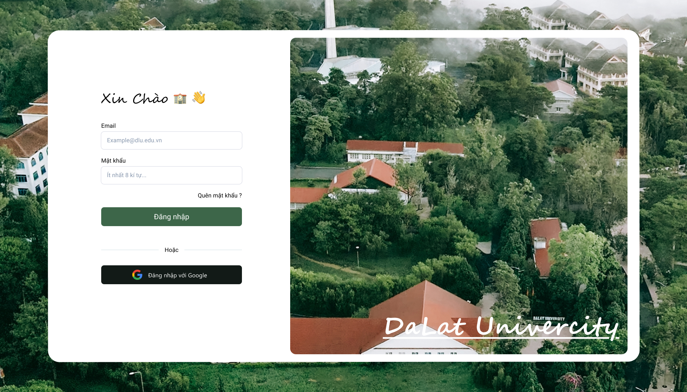
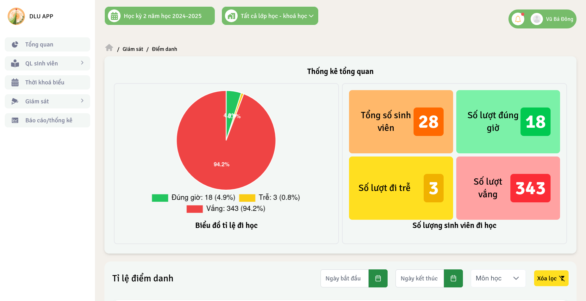
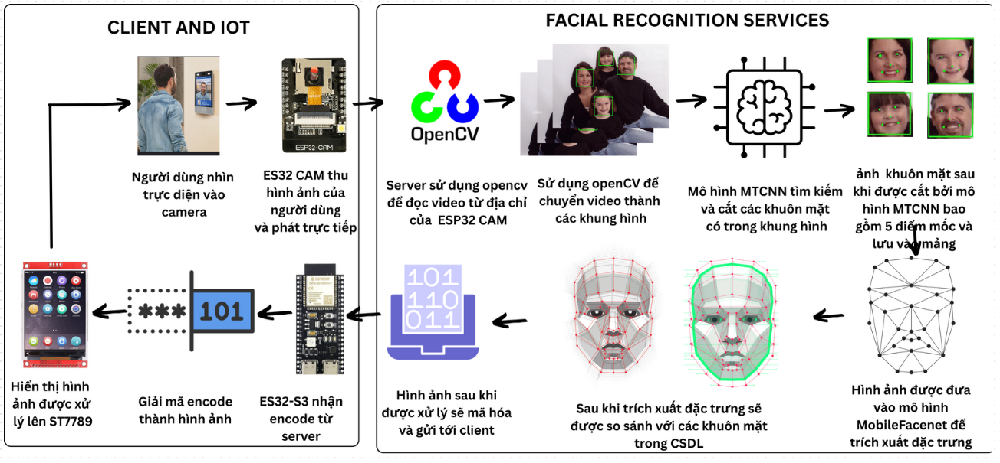
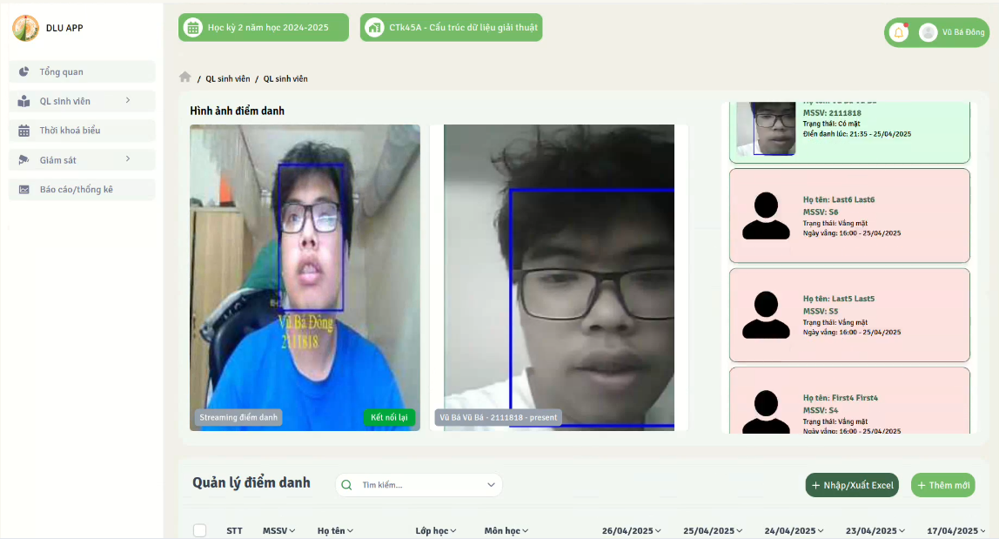
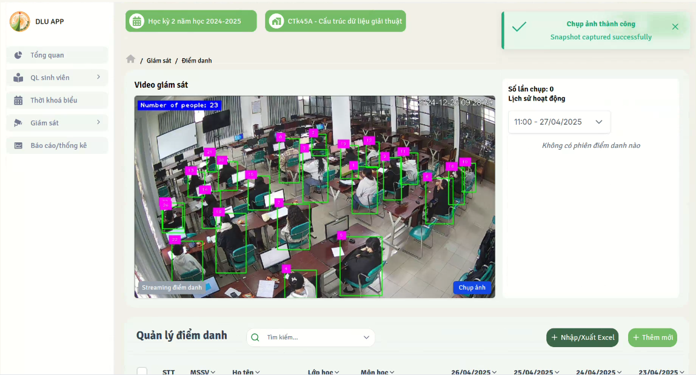

# 🎓 Class Manager System – Lecturer Frontend

Đây là giao diện quản lý dành riêng cho **giảng viên** trong hệ thống **Class Manager System**, giúp giảng viên theo dõi, quản lý lịch dạy, điểm danh và sinh viên trong lớp một cách dễ dàng, trực quan và real-time.

Để có thể hoạt động được ứng dụng vui lòng cài đặt các services backend phụ thuộc:
- (🔐 Auth CMS Backend)[https://github.com/Dong071102/cms-auth-API-service] là một dịch vụ xác thực và phân quyền người dùng được xây dựng bằng Golang + Echo, phục vụ cho hệ thống quản lý lớp học thông minh. Hệ thống cung cấp các tính năng quản lý tài khoản, xác thực JWT, phân quyền theo vai trò (role-based access control), và khôi phục mật khẩu.
- (📚 CMS Backend Services)[https://github.com/Dong071102/manager-cms-API-service] là hệ thống API được viết bằng Golang (Echo framework), phục vụ cho ứng dụng quản lý điểm danh sinh viên, lớp học, giảng viên và camera AI.
- (🖼️ Image Handle Services CMS)[https://github.com/Dong071102/image-handle-server-cms-service] là một dịch vụ đơn giản sử dụng Node.js + Express để phục vụ ảnh tĩnh được sinh ra bởi hệ thống nhận diện khuôn mặt (Face Recognition) và hệ thống đếm người (Human Counter). Dịch vụ giúp client có thể truy cập các ảnh snapshot đã lưu thông qua HTTP.
- (😳 Facial recognition service)[https://github.com/Dong071102/facial-recognition-cms-AI-service/tree/main] là một dịch vụ điểm danh thông minh bằng cách nhận diện khuôn mặt thời gian thực qua camera IP hoặc webcam, sử dụng MCTNN + MobileFaceNet.
- (👀 Human Counter CMS)[https://github.com/Dong071102/human-couter-cms-AI-service] là một dịch vụ sử dụng mô hình YOLO và OpenCV để đếm số lượng người trong thời gian thực từ camera IP hoặc video file. Hệ thống được triển khai thông qua WebSocket server và có thể chụp ảnh bằng yêu cầu từ client.
- (📥 CMS DB)[https://github.com/Dong071102/CMS_DB] và đừng quên import cơ sở dữ liệu cho hệ thống
---

## 🚀 Tính năng chính cho giảng viên

### 📅 Quản lý lịch giảng dạy
- Hiển thị lịch dạy theo tuần
- Xem lớp học sắp diễn ra trong 2 giờ tới
- Giao diện dạng calendar/table trực quan

### 📋 Quản lý lớp học & sinh viên
- Xem danh sách lớp đang giảng dạy
- Xem danh sách sinh viên theo lớp
- Thêm / xóa / chỉnh sửa sinh viên
- Cập nhật điểm danh thủ công

### 📊 Báo cáo điểm danh
- Tổng hợp số buổi điểm danh
- Tỷ lệ chuyên cần của từng sinh viên
- Tra cứu lịch sử điểm danh

### 🤖 Tích hợp AI Camera
- Xem ảnh nhận diện khuôn mặt từ camera (Face Recognition)
- Xem ảnh đếm người trong lớp học (Human Counter)
- Giao tiếp WebSocket để stream ảnh real-time

---

## 🛠 Công nghệ sử dụng

| Công nghệ | Vai trò |
|----------|---------|
| ⚛️ React + Vite | Giao diện người dùng hiện đại |
| 🧠 TypeScript | An toàn, rõ ràng |
| 💨 TailwindCSS | Thiết kế responsive, tiện lợi |
| 🔄 React Query | Quản lý gọi API, caching |
| 🧩 Context / Zustand | Quản lý trạng thái đăng nhập |
| 🌐 WebSocket | Nhận ảnh AI real-time |
| 🔐 JWT Token | Phân quyền theo vai trò `lecturer` |

---

## ⚙️ Cài đặt & chạy ứng dụng

### 1. Clone project

```bash
git clone https://github.com/yourusername/class_manager_frontend.git
cd class_manager_frontend
```

### 2. Cài dependencies

```bash
npm install
# hoặc:
yarn
```

### 3. Chạy project

```bash
npm run dev
# hoặc:
yarn dev
```

Ứng dụng chạy tại: `http://localhost:5173`

---

## 🔗 Biến môi trường `.env`

```env
VITE_API_URL=http://localhost:8080              # CMS Backend
VITE_AUTH_API_URL=http://localhost:8081         # Auth Service
VITE_WEBSOCKET_URL=ws://localhost:11000         # WebSocket Camera AI
VITE_IMAGE_URL=http://localhost:15000           # Image Handle Service
```

---

## 📁 Cấu trúc thư mục chính

```
src/
├── pages/                 # Trang: Dashboard, Attendance, Profile,...
├── components/            # Header, Sidebar, Table,...
├── services/              # Gọi API backend
├── sockets/               # Kết nối WebSocket
├── types/                 # TypeScript types
├── hooks/                 # Custom hooks
├── stores/                # Auth / UI state
└── utils/                 # Helper functions
```

---

## 🧑‍🏫 Phân quyền

- Giảng viên khi đăng nhập sẽ được gán role `"lecturer"`
- Các route được bảo vệ bằng `ProtectedRoute` và `AuthContext`

---

## 📧 Tác giả

## 📷 Hình ảnh (Screenshots)
- **Screenshot 1**  
	  
	Caption: Trang đăng nhập ứng dụng

- **Screenshot 2**  
	  
	Caption: Giao diện bố cục chính của ứng dụng.
- **Screenshot 3**  
	  
	Caption: Trang thống kê tỉ lệ đi học của sinh viên.
- **Screenshot 4**  
	  
	Caption: Luồng hoạt động chức năng điểm danh khuôn mặt.


- **Screenshot 5**  
	  
	Caption: Trang quản lý các phiên điểm danh.

- **Screenshot 6**  
	  
	Caption: Trang giám sát và thống kê số lượng sinh viên theo thời giant thực.


- **Tên**: Vũ Bá Đông  
- 📩 Email: [vubadong071102@gmail.com](mailto:vubadong071102@gmail.com)

